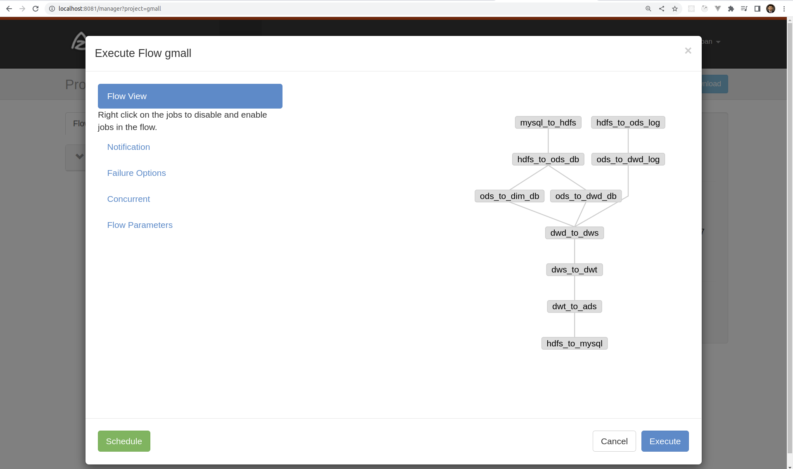
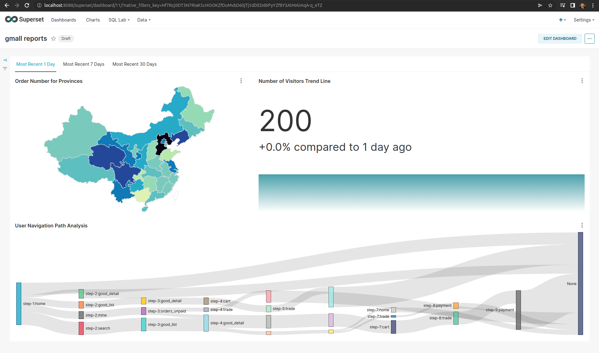
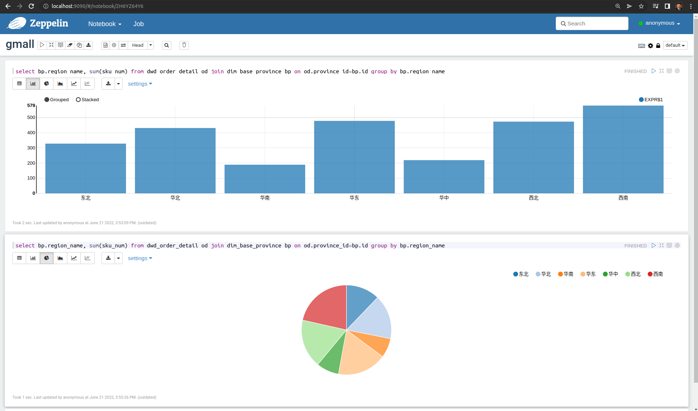

# Datawarehouse for e-commerce

## Description
This project is a datawarehouse for storing, processing and visualizing two types of data generated 
at an e-commerce website:

- log data of user behavior stored in files, 
- business process data stored in MySQL.

The datawarehouse has 5 layers from bottom to top: ODS, DWD, DWS, DWT, ADS and also the DIM layer for all dimension tables.
Data in the lower layer are the input to its upper layer. The input to the ODS layer comes from the log files and the tables in MySQL.

### ODS
The business process data stored in the tables in MySQL are imported into HDFS using Sqoop (mysql_to_hdfs_init.sh for first day, mysql_to_hdfs.sh for following days).
The storage format is lzop (i.e., splittable LZO compression). And the LZO index file is created for each table.

The log data are imported using Flume and Kafka. The pipeline is like: file -> Flume -> Kafka -> Flume -> HDFS.
For the first Flume conf has ```TAILDIR``` source and Kafka sink. The second Flume conf has Kafka source and HDFS sink.
An interceptor (```TimeStampInterceptor.java```) is added in the second Flume conf to change the time stamp to the one in the log data.

All Hive tables are partitioned on date and stored in compressed lzop format as external tables.

### DIM
The dimension tables are stored in the DIM layer (```ods_to_dim_db.sh```). The dim_user_info dimension table is a zipper table with time as the slow dimension.
Its construction is relatively complicated (```dim_user_info.sql```).
Note:
- hive.input.format defaults to CombineHiveInputFormat, which will combine the index file with the lzop file. So ```set hive.input.format=org.apache.hadoop.hive.ql.io.HiveInputFormat;```
- To enable dynamic partitioning in hive, ```set hive.exec.dynamic.partition.mode=nonstrict;```

### DWD
The fact tables are stored in the DWD layer (```ods_to_dwd_log.sh``` for all days, ```ods_to_dwd_db_init.sh``` for the first day and ```ods_to_dwd_db.sh``` for the following days).
The log data are stored as json strings and one line per record, so I used ```get_json_object``` in hive to process all log data.
User action logs contain action info in json arrays, which need to be "exploded" using a UDTF function (```ExplodeJsonArray.java```) before being processed with ```get_json_object```.

Some fact tables are transactional fact tables, some are daily periodic snapshots and some are accumulating snapshots.

### DWS
Daily summaries of fact tables from the DWD layer are stored in the DWS layer (```dwd_to_dws_init.sh``` for first day and ```dwd_to_dws.sh``` for every following day).

### DWT
Topic (theme) summaries of fact tables aggregated for 1 day, 7 days and 30 days are stored in the DWT layer (```dws_to_dwt_int.sh``` for first day, 
```dws_to_dwt.sh``` for every following day).

### ADS
Statistics about visitor session info, user/visitor navigation path analysis (for Sankey plots later on), 
new users, active users, new orders, product purchases, coupon and discount usages etc., 
are constructed and stored in this layer (```dwt_to_ads.sh```).

### Workflow
Job scheduling is handled using Azkaban. The job dependencies
and the entire daily workflow is shown in the following image.  
The required input files are in the directory ```azkaban```.

Note:
- The tables in the ADS layer are stored on HDFS. They need to be copied into MySQL at the end of the workflow. 
The script ```hdfs_to_mysql.sh``` exports the Hive tables into MySQL using Sqoop.

### Visualization and Ad-hoc Queries
The tables exported into MySQL can be visualized using Superset, which has connectors with many data sources including MySQL.
The following image shows a Superset dashboard with 3 charts: order number grouped by provinces, 
active daily users and Sankey flow chart for user navigation patterns. 

Ad-hoc queries are implemented using Presto and Kylin. Kylin does a lot of pre-computing to construct the OLAP cube (stored in HBase), 
Presto is more memory-intensive.

Zeppelin can interact with data services including Kylin. The following screenshot shows some simple visualizations using 
SQL inside a Zeppelin notebook. 

Note:
- Kylin cannot process composite types (Array, Map, Struct) in Hive tables. So table views without those columns containing composite types are created (```dim_sku_info_view.sql```)

## Built-With
- Hadoop
- Hive-on-Spark
- HBase
- Flume
- Kafka
- Sqoop
- Kylin
- Presto
- Superset
- Zeppelin
- Azkaban
- Zookeeper


